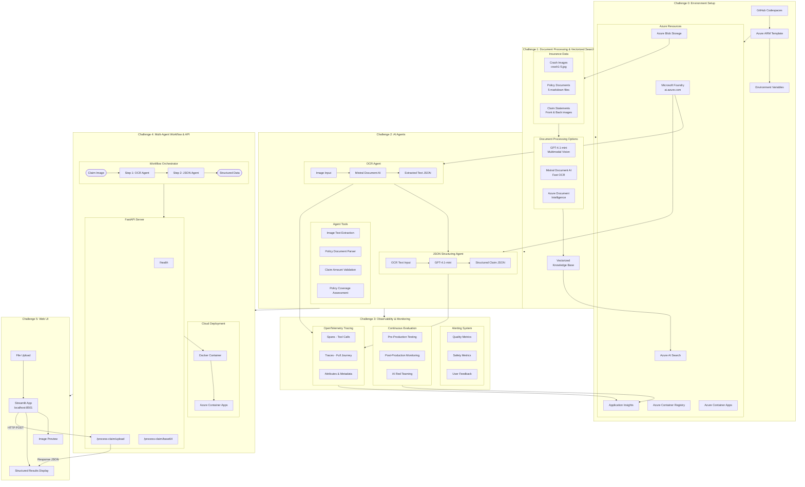

# Claims Processing with Microsoft Foundry Agents Hackathon

Today, you'll dive into the world of intelligent agent systems powered by Azure AI to revolutionize insurance claims processing. Get ready for a hands-on, high-impact day of learning and innovation!

## Introduction

Transform insurance claims processing into an AI-native, enterprise-ready system using Microsoft Foundry and the Model Context Protocol. This hackathon uniquely combines three cutting-edge approaches: **compare multiple AI document processing techniques** (GPT-4.1-mini vision, Mistral Document AI, and Azure Document Intelligence) to learn when to use each based on cost and accuracy; **build with the next-generation Microsoft Foundry platform** (ai.azure.com) featuring integrated vectorization, continuous evaluation, and OpenTelemetry tracing for the complete GenAIOps lifecycle; **deploy as an MCP server** through Azure API Management, making your multi-agent workflow accessible to GitHub Copilot, Claude Desktop, and other AI assistants; and **build a user-friendly web interface** using Streamlit to complete the end-to-end solution. From vectorized search foundations through intelligent agent orchestration to AI-native deployment and user interfaces, you'll master the full stack of enterprise AI development—building systems that are observable, scalable, secure, and seamlessly integrated with the broader AI ecosystem.

## Architecture Overview

## Learning Objectives 🎯

By participating in this hackathon, you will learn how to:

- **Compare Multiple AI Document Processing Approaches**: Implement and evaluate GPT-4.1-mini, Mistral Document AI, and Azure Document Intelligence—learning when to use each based on document type, cost, and accuracy needs.
- **Build with Microsoft Foundry Platform**: Master the next-generation [Microsoft Foundry portal](ai.azure.com/nextgen) including agent creation with meta-prompts, integrated vectorization, hybrid search, continuous evaluation, and OpenTelemetry tracing.
- **Orchestrate Multi-Agent Workflows**: Create intelligent agents using Microsoft Agent Framework that coordinate specialized agents (OCR, JSON structuring, validation), implement function calling, and generate structured outputs.
- **Implement GenAIOps Best Practices**: Apply the complete AI operations lifecycle—pre-production evaluation, AI red teaming, continuous monitoring, Application Insights integration, and proactive alerting.
- **Deploy MCP Servers for AI-Native Integration**: Package workflows as Model Context Protocol servers through Azure API Management.

## Requirements
To successfully complete this hackathon, you will need the following:

- GitHub account to access the repository and run GitHub Codespaces and Github Copilot. 
- Be familiar with Python programming, including handling JSON data and making API calls.​ 
- Be familiar with Generative AI Solutions and Azure Services. 
- An active Azure subscription, with Owner rights. 
- Ability to provision resources in **Sweden Central** or [another supported region](https://learn.microsoft.com/en-us/azure/ai-foundry/openai/concepts/models?tabs=global-standard%2Cstandard-chat-completions#global-standard-model-availability). 

## Arquitetura

## Challenges

- **Challenge 00**: **[Environment Setup & Azure Resource Deployment](challenge-0/README.md)**: Fork the repository, set up GitHub Codespaces development environment, deploy Azure resources (Microsoft Foundry, Azure AI Search, Blob Storage), configure environment variables with automated scripts, and verify your setup for the hackathon
- **Challenge 01**: **[Document Processing and Vectorized Search](challenge-1/README.md)**: Build a comprehensive document processing and search system using GPT-4-1-mini for multimodal processing, implement Azure AI Search with integrated vectorization for semantic retrieval, create hybrid search capabilities (keyword + vector + semantic), and establish the knowledge base foundation for AI agents
- **Challenge 02**: **[Build your 2 Claims Processing Agents](challenge-2/README.md)**: Create an intelligent AI agent using Microsoft Agent Framework and Microsoft Foundry that autonomously orchestrates the document processing pipeline from Challenge 1, implements agent tools for OCR and policy validation, makes intelligent decisions about claim processing, and generates structured outputs
- **Challenge 03**: **[Observability and Monitoring for AI Agents](challenge-3/README.md)**: Implement comprehensive observability for your Claims Processing Agents using Microsoft Foundry's capabilities—set up OpenTelemetry tracing, configure continuous evaluation for quality and safety metrics, integrate Application Insights, and establish proactive alerting for production systems
- **Challenge 04**: **[Agent Orchestration and MCP Server Deployment](challenge-4/README.md)**: Orchestrate the OCR and JSON Structuring agents into a multi-agent workflow using Microsoft Agent Framework, implement workflow executors with typed message passing, deploy the workflow as a Model Context Protocol (MCP) server, and integrate with VS Code, Claude Desktop, or other MCP-compatible platforms for reusable AI tooling
- **Challenge 05**: **[Claims Processing UI](challenge-5-ui/README.md)**: Build a user-friendly web interface using Streamlit to consume the Claims Processing API, upload insurance claim images, view structured results extracted by the multi-agent workflow, and complete the end-to-end claims processing solution

## Contributing

This project welcomes contributions and suggestions.  Most contributions require you to agree to a
Contributor License Agreement (CLA) declaring that you have the right to, and actually do, grant us
the rights to use your contribution. For details, visit [Contributor License Agreements](https://cla.opensource.microsoft.com).

When you submit a pull request, a CLA bot will automatically determine whether you need to provide
a CLA and decorate the PR appropriately (e.g., status check, comment). Simply follow the instructions
provided by the bot. You will only need to do this once across all repos using our CLA.

This project has adopted the [Microsoft Open Source Code of Conduct](https://opensource.microsoft.com/codeofconduct/).
For more information see the [Code of Conduct FAQ](https://opensource.microsoft.com/codeofconduct/faq/) or
contact [opencode@microsoft.com](mailto:opencode@microsoft.com) with any additional questions or comments.

## Trademarks

This project may contain trademarks or logos for projects, products, or services. Authorized use of Microsoft
trademarks or logos is subject to and must follow
[Microsoft's Trademark & Brand Guidelines](https://www.microsoft.com/legal/intellectualproperty/trademarks/usage/general).
Use of Microsoft trademarks or logos in modified versions of this project must not cause confusion or imply Microsoft sponsorship.
Any use of third-party trademarks or logos are subject to those third-party's policies.